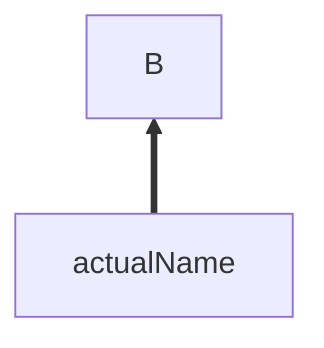

# Open Source

Mermaid JS: Create HTML/markdown diagrams with a JS library.

Mermaid Github: https://github.com/mermaid-js/mermaid  
Tutorial: https://www.youtube.com/watch?v=JiQmpA474BY  
Cheatsheet: https://jojozhuang.github.io/tutorial/mermaid-cheat-sheet/

## First issue

https://github.com/mermaid-js/mermaid/issues/4644

